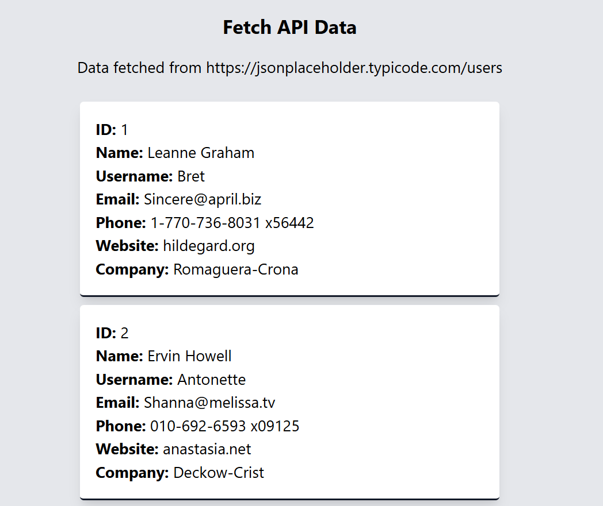

# What is useEffect?

useEffect is a React Hook that allows you to run side effects in functional components.
A “side effect” means anything that happens outside the normal component rendering flow.

# What Are Side Effects?

Side effects include:

Fetching data from an API

Updating the document title

Subscribing to events (like scroll, resize)

Working with timers (setInterval, setTimeout)

Syncing data with localStorage

Connecting to WebSockets or external services

# When Does useEffect Run?

useEffect runs after the component renders.
Its execution depends on the dependency array.

# Why is useEffect Needed?

React components should remain pure; side effects must NOT be in the main rendering function

It organizes all side effects in a controlled place

Prevents unwanted behavior like infinite renders

Helps synchronize UI with external systems

# Key Concepts to Know (Interview Focus)
1. No Dependency Array

Effect runs after every render.
Used rarely; can cause performance issues.

2. Empty Dependency Array

Effect runs only once, after the first render.
Used for one-time actions like fetching data.

3. Dependency-Based Execution

Effect runs only when specific variables change.
Used for reacting to state or props updates.

4. Cleanup Function

Used to stop memory leaks by cleaning:

Event listeners

Intervals

Subscriptions

External connections

1. What problems does useEffect solve?

useEffect solves the problem of running side effects in functional components.
Side effects include tasks like API calls, timers, subscriptions, and updating the DOM outside React.
Before hooks, these required lifecycle methods in class components.
useEffect gives a clean and consistent way to run side effects in function components.

2. What is the purpose of the dependency array?

The dependency array controls when the effect should run.
React compares the values in the array after every render.
If any value changes, the effect runs again.
This prevents unnecessary executions and improves performance.

3. Why can a missing dependency cause bugs?

A missing dependency means React does not know it needs to re-run the effect when that value changes.
As a result:

The effect may use stale values

Changes may not trigger expected behavior

React’s data flow becomes inconsistent
This is why the linter warns about missing dependencies.

4. How does the cleanup function work?

The cleanup function runs before the effect runs again and when the component unmounts.
Its purpose is to remove or stop anything that could cause memory leaks, such as:

Event listeners

Timers

Subscriptions

External connections
It resets the effect’s environment to keep things predictable.

5. Why does useEffect run after rendering?

Effects run after rendering to keep the component’s render phase pure and predictable.
Rendering should only calculate UI — not perform side effects.
Running effects afterward ensures the UI is ready before the effects interact with external systems.

6. How does React prevent infinite loops?

React uses the dependency array to control when effects run.
If you update state inside an effect without proper dependencies, the effect re-runs endlessly.
To prevent this, React:

Warns about missing dependencies

Expects developers to specify exactly when effects should run
This design helps you avoid unintentional infinite renders.

7. What’s the difference between useEffect and useLayoutEffect?
useEffect

Runs after the browser paints the UI

Non-blocking

Good for API calls, timers, subscriptions

Does not delay page rendering

useLayoutEffect

Runs before the browser paints

Blocking (halts painting until finished)

Used when you must measure layout or make DOM adjustments synchronously

Rarely needed; can impact performance if overused

