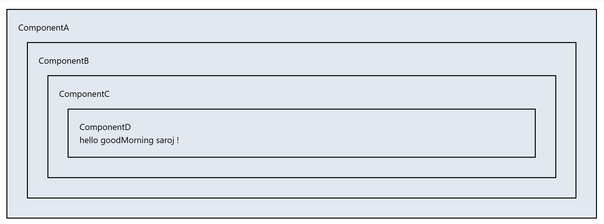
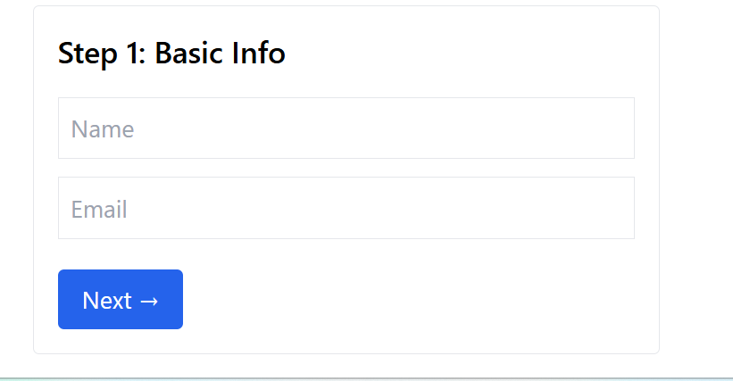

# What is Props Drilling?

Props drilling occurs when data is passed from a top-level component to deeply nested child components, even when only the lowest component actually needs the data.
In this process, each intermediate component receives the props only to pass them further down, even if they do not use the props themselves.

# Why is Props Drilling a Problem?

Makes components tightly coupled

Reduces readability and maintainability

Leads to unnecessary re-renders

Makes the component tree harder to manage as the application grows

Harder to refactor or rearrange component structure

# When Does Props Drilling Happen?

Props drilling happens when:

Data or functions need to be shared across multiple levels

The component that needs the data is not directly a child of the source component

The system lacks a global or shared state management solution

# Common Real-Life Example (Conceptually)

A parent component has user data, but a deeply nested component needs it.
Parent → Child → Grandchild → GreatGrandchild
Each component must forward the same props, even though only the last component actually uses them.

# How to Avoid Props Drilling?

You can avoid props drilling using:

React Context API (useContext)

State management libraries like Redux, Zustand, MobX

Custom hooks that provide shared logic

React Query for server state

Component composition patterns

# Key Points to Remember

Props drilling = passing props through layers unnecessarily

Causes complexity and tightly-coupled components

Avoid with Context API or global state

# 📌 useContext 

# 1. What is useContext?

useContext is a React Hook that allows functional components to access data from a context without passing props through intermediate components.
It solves the problem of props drilling by providing a global-like state for a specific subtree of components. 

# 2. Why is useContext important?

Eliminates the need for passing props down multiple layers

Makes components more maintainable and readable

Centralizes shared state for themes, authentication, language settings, etc.

Simplifies communication between deeply nested components

# 3. How does useContext work?

First, you create a context with createContext()

Then, you wrap the components that need access in a Provider

Finally, any nested component can use useContext() to read the value

#  4. When should you use useContext?

Sharing global data like authenticated user info

Theme toggling (dark/light mode)

Language/translation settings

Avoiding props drilling for frequently used state

# 5. Limitations of useContext

Changes in context re-render all consumers, which may affect performance

Not meant for high-frequency updates (e.g., animations)

Works best with small or medium-sized shared state; for complex state, consider Redux or Zustand.

Take input form FormContext 
FormContext can be used to take details for Form ,
one of the image is given below : 

