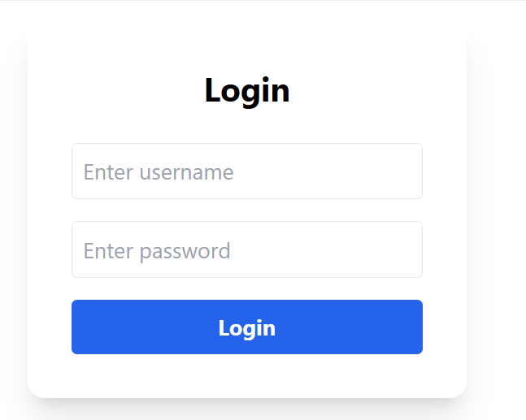

# React Protected Routes Demo

A simple React project demonstrating **protected routes**, **role-based access**, and **login/logout** functionality.

---

## Features

- Login page with username and password
- Admin and User roles
- Protected Dashboard (all users)
- Admin page (admin only)
- Unauthorized page for forbidden access
- Navbar with responsive menu and Logout button

---

## Demo Credentials

- **Admin:** username: `admin`, password: `12345`  
- **User:** username: `user`, password: `12345`  



---
http://localhost:5173/login 
## Installation

```bash
git clone <your-repo-url>
cd <your-project-folder>
npm install
npm start
