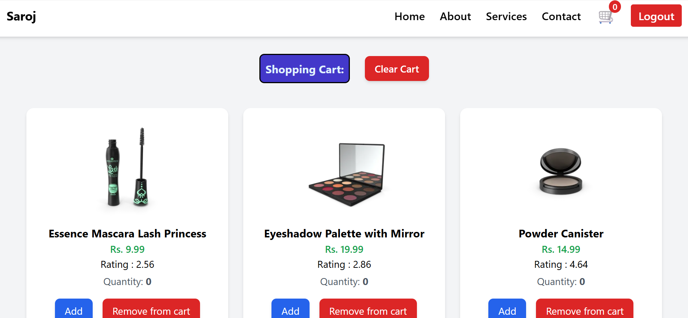

📌 Redux – Important Questions & Definitions

1. What is Redux? → Redux is a predictable state management library with a centralized store.

2. What is a Store? → The centralized container that holds the entire application state.

3. What is an Action? → A plain JavaScript object that describes what change should happen.

4. What is a Reducer? → A pure function that takes state + action and returns new state.

5. What is a Pure Function? → A function that gives the same output for the same input and has no side effects.

6. What is Dispatch? → A method used to send (dispatch) actions to the Redux store.

7. What is Subscribe? → A method that listens to store state changes.

8. What is Middleware? → Functions that run between dispatching an action and the reducer.

9. What is Redux Thunk? → A middleware used to write asynchronous logic (like API calls).

10. What is Redux Toolkit (RTK)? → The official modern Redux toolset that reduces boilerplate.

11. What is createSlice? → A function that automatically generates actions and reducers.

12. What is createAsyncThunk? → A function used to handle async operations such as API calls.

13. What is useSelector? → A hook to read/select data from the Redux store.

14. What is useDispatch? → A hook to dispatch actions inside React components.

15. Why use Redux? → Centralized state, predictable flow, cleaner debugging, avoids prop drilling.

16. What is Immutable State? → State must not be modified directly; always return a new copy.

17. What is Redux DevTools? → A debugging tool to inspect actions, state history, and time-travel debugging.

18. What is combineReducers? → A helper function to merge multiple reducers into one root reducer.

19. Can Redux be used without React? → Yes, Redux works with React, Vue, Angular, Node.js, or plain JavaScript.

20. When should I use Redux? → When many components share data, complex logic exists, or prop drilling becomes messy.
