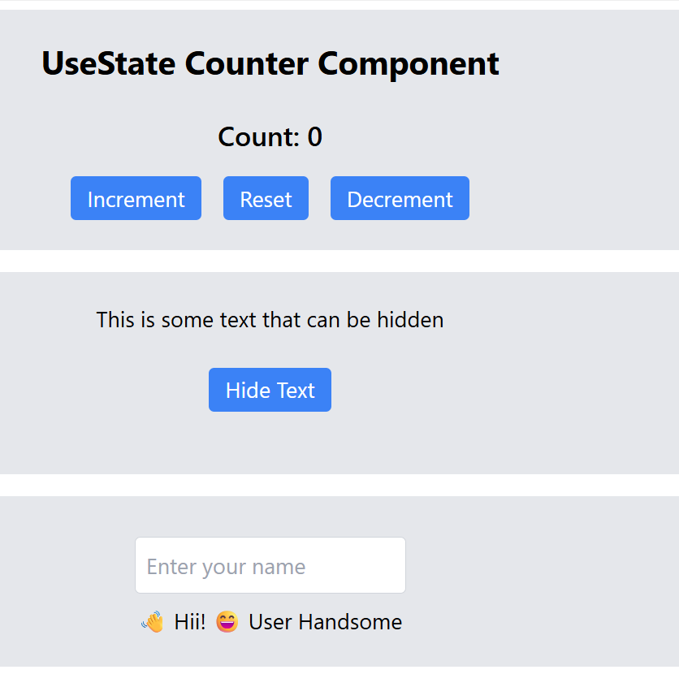

# 1️⃣ What is state in React?
State is a special data storage in a component that allows it to remember values and update the UI automatically when those values change.

# What types of values can state hold?

Strings → useState("")

Numbers → useState(0)

Booleans → useState(true)

Arrays → useState([])

Objects → useState({})

# What happens when state changes?
When state is updated via its setter, React re-renders the component to reflect the new value in the UI.

# Why is State Required?

State is required because:

React components need to reactively update the UI when data changes.

Without state, you cannot remember user input, toggle visibility, or track values in a component.

It makes components interactive and dynamic.

##### Example:

1. Hide/Show text toggle

2. Increment/Decrement counter

3. Todo list items 

# What is the Hook for State?

The useState Hook is a special function provided by React to create state in functional components.
It returns two things:

The state value (e.g., count)

The setter function to update the state (e.g., setCount)

# How to Use State in Different Components

Each component can have its own state.

State is local to the component unless shared via props or Context.

Sharing state: Use lifting state up or Context API.

# Common Interview Question

Q: Why can’t we just use regular variables instead of state in React?
A: Regular variables don’t trigger re-rendering when they change, so the UI won’t update. State ensures React reactively updates the UI when values change.

